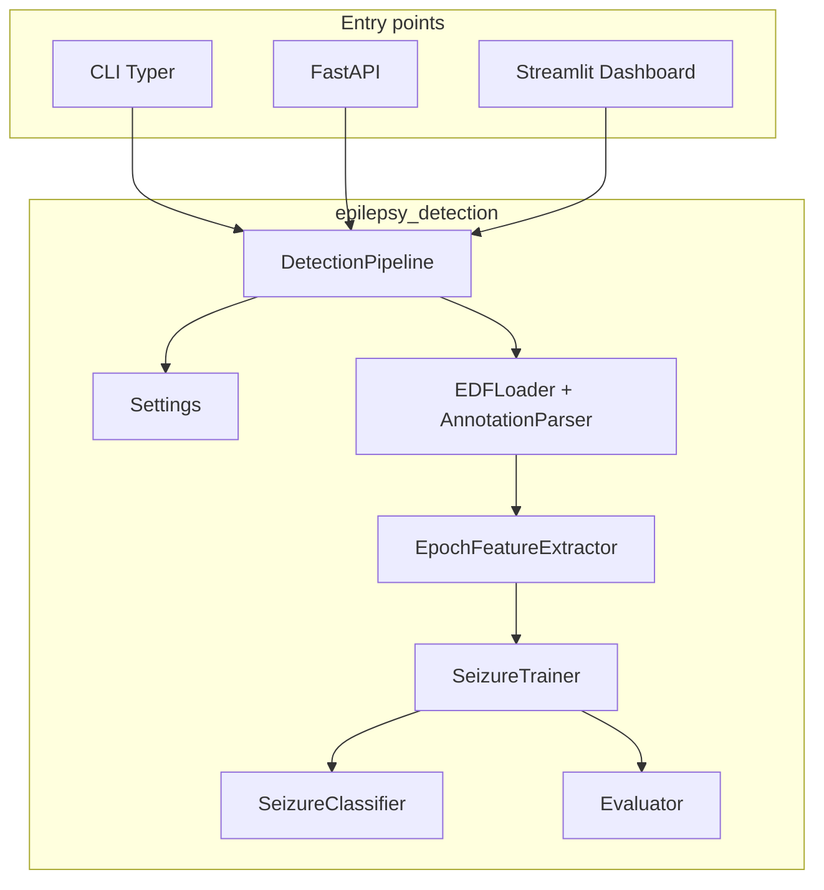

# Architecture

## Overview

Epilepsy Detection is a layered Python application that converts the original monolithic Jupyter notebook into testable, headless modules with multiple entry points.

**Data:** No patient EEG is stored in this repository. Reviewers run tests with synthetic data; full pipeline execution requires locally downloaded [CHB-MIT](https://physionet.org/content/chbmit/1.0.0/) files — see [DATA.md](DATA.md).

## Data flow

1. **EDFLoader** reads scalp EEG via MNE.
2. **EpochFeatureExtractor** computes per-second, per-channel statistics and band energies (FIR filters), labeling ictal epochs from `SeizureInterval`.
3. **SeizureClassifier** applies `MinMaxScaler`, `RFECV`, and XGBoost with optional hyperparameter search.
4. **SeizureTrainer** persists scaler, RFE support, and model to `models/seizure_model.joblib`.
5. **Evaluator** reports accuracy, sensitivity, specificity, and confusion matrix plots.

## Design decisions

| Concern | Approach |
|---------|----------|
| Notebook globals | Instance state on pipeline and classifier classes |
| tkinter in core | Removed from library; GUI is optional thin layer |
| Scaler leakage | Training scaler/RFE saved and reused at inference |
| Missing metrics | `confusion_metrics` and `draw_confusion_matrix` implemented |
| Large CHB-MIT data | Features cached as Parquet; EDF paths via env vars |

## Module map

| Module | Class | Responsibility |
|--------|-------|----------------|
| `config.settings` | `Settings` | YAML + env configuration |
| `data.edf_loader` | `EDFLoader` | MNE EDF I/O |
| `data.annotations` | `AnnotationParser` | Seizure interval parsing |
| `features.epoch_features` | `EpochFeatureExtractor` | SzData port |
| `models.classifier` | `SeizureClassifier` | RFECV + XGBoost |
| `models.imbalance` | helpers | SMOTE, RUSBoost |
| `training.trainer` | `SeizureTrainer` | Fit/save/load |
| `evaluation.metrics` | `Evaluator` | Reports and plots |
| `pipeline.detection_pipeline` | `DetectionPipeline` | Orchestration |

## Configuration

Default parameters live in [`config/default.yaml`](../config/default.yaml):

- Sample rate: 256 Hz
- Epoch: 1 second
- Baseline: 10 seconds
- Band edges: 0.5–12.5–25 Hz (two bands)
- RFECV: minimum 16 features, 3-fold CV

Override via environment variables prefixed with `EPILEPSY_`.
